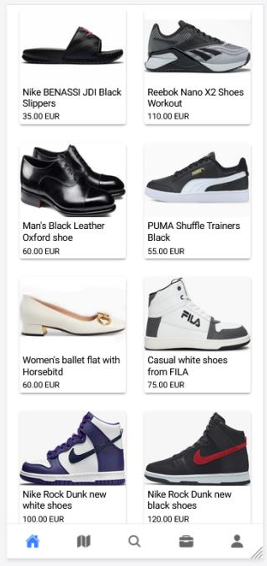
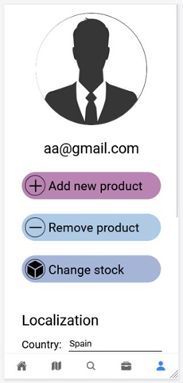
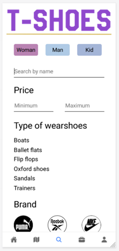
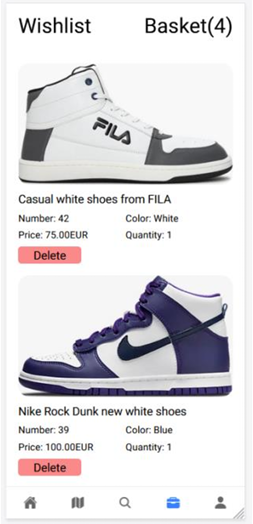
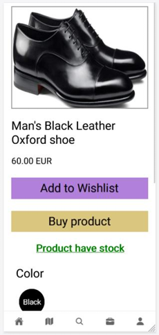
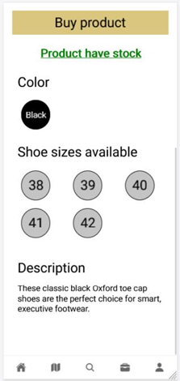

# Mobile application
### 1. The objective is to create a mobile application to sell all kinds of shoes.

The application is used both for users and administrators. It has pages where the admins can add new products/shoes and update the stock status of each product.

The technologies used is:
- Figma
- TypeScript
- Angular
- Ionic

Some resulting pages are:
<table>
  <tr>
    <td></td>
    <td></td>
    <td></td>
</tr>
  <tr>
    <td style="text-align: center;"><em>1. Homepage</em></td>
    <td style="text-align: center;"><em>2. User profile</em></td>
    <td style="text-align: center;"><em>3. Filters</em></td>
  </tr>
</table>

<table>
  <tr>
    <td></td>
    <td></td>
    <td></td>
</tr>
  <tr>
    <td style="text-align: center;"><em>1. Wishlist</em></td>
    <td style="text-align: center;"><em>2. Product details 1</em></td>
    <td style="text-align: center;"><em>3. Product details 2</em></td>
  </tr>
</table>